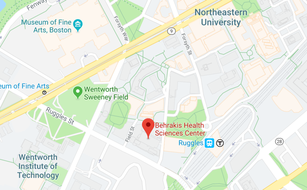
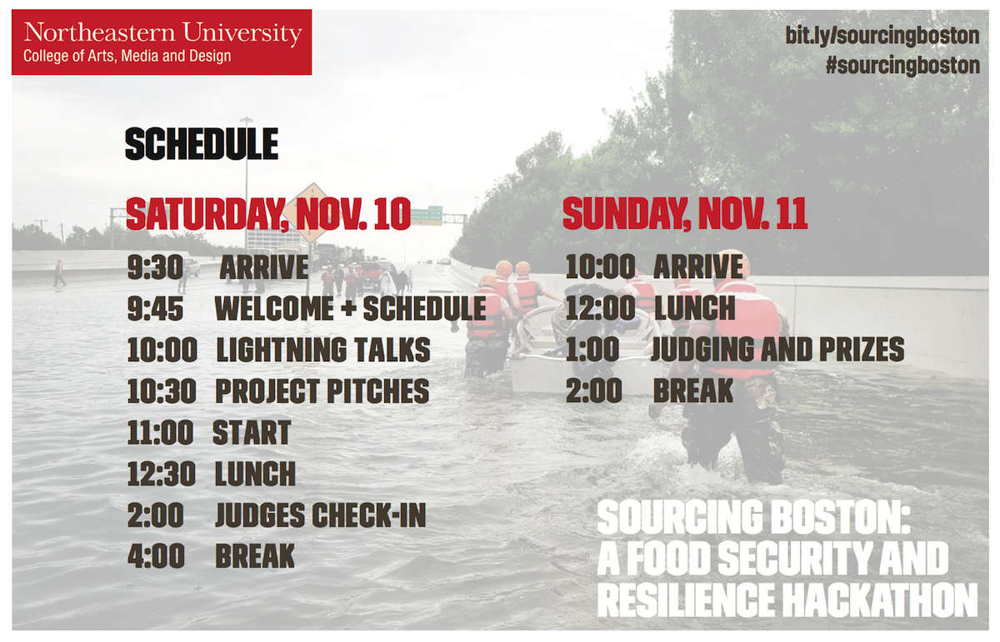
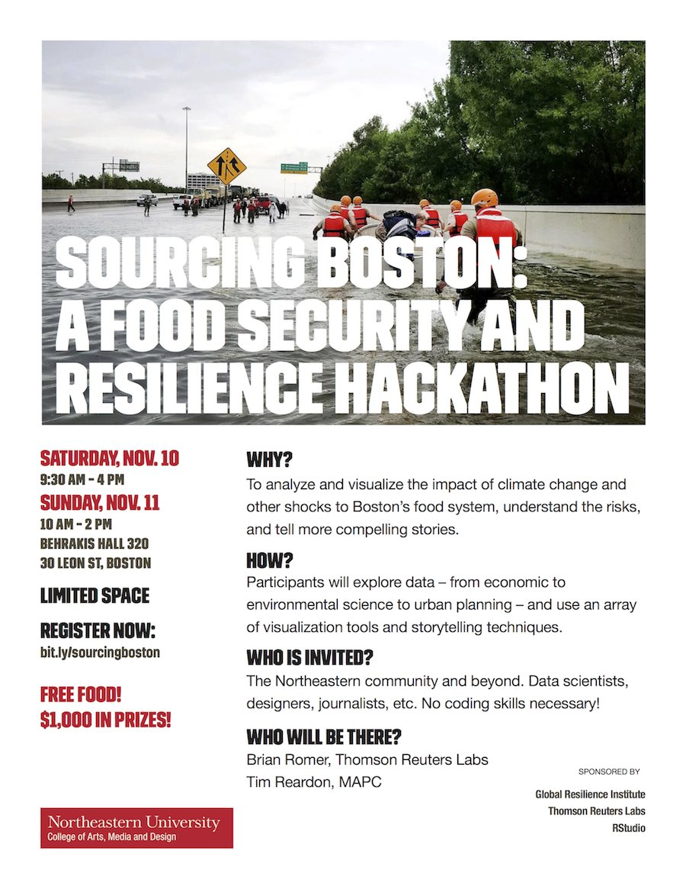

# Visualizing the impact of climate change and other shocks to Boston's food system

## overview

How stable and just is Boston's food system? What does it look like, in size and complexity? 

On the weekend of November 10th and 11th, Northeastern University’s College of Arts, Media and Design and the Global Resilience Institute will host **Sourcing Boston**, a hackathon where participants will explore data – from economic to environmental science to urban planning – to tell compelling stories and draw insights about food insecurity, economic disruption and resilience.

This event, in partnership with [Thomson Reuters Labs](https://innovation.thomsonreuters.com/en/labs.html), [Red Tomato](https://www.redtomato.org/), and [Project Bread](http://www.projectbread.org/about-project-bread/), and with support from [RStudio](https://www.rstudio.com/), Northeastern's [Global Resilience Institute](https://globalresilience.northeastern.edu) and [TCB Analytics](http://tcbanalytics.com/), will challenge participants to leverage data, analytics and visualization to find new ways of telling stories and deriving insights about how climate change and other shocks can disrupt food systems, supply chains and basic infrastructure in Boston.

[register on eventbrite](http://bit.ly/sourcingboston)

## logistics

The hackathon will start with coffee, snacks and lightning talks in Behrakis Hall 010 (30 Leon Street, Boston), and then move to breakout sessions in Ryder Hall rooms 399, 399A, 403 and 405. 

[view on google maps](https://www.google.com/maps/place/Behrakis+Health+Sciences+Center,+30+Leon+St,+Boston,+MA+02115/@42.3371872,-71.0941257,16.34z/data=!4m5!3m4!1s0x89e37a2186d3bb6f:0xfd38cae6175b8ff6!8m2!3d42.3367142!4d-71.0916533)

Lunches, snacks and drinks will be provided throughout the weekend. 

### schedule

## project directions

Participants are encouraged to team up, and to compose teams of people from different backgrounds and skillsets. Prizes will be awarded for projects that tackle the following:

### 1. Food supply chain chokepoints
How does Boston-area food get here? Where are the distribution centers? How much, and what kinds of our food are locally sourced? What would happen to our current supply chain if sea levels rise or another disruptive event befalls the city?

### 2. Food desert exploration
Access to good, affordable food isn't a feature of every neighborhood. Which ones have the best, and which ones the least? How do we measure access to food - in number of groceries and their distance? What about how much time it takes to access food? What about its level of healthiness? 

### 3. Changing weather patterns
Climate change is already altering seasonal patterns, ocean surface temperature, the number and intensity of tropical storms, and polar ice. How do these changes affect our ability to produce and transport food? Which crops - among the ones we import the most, and the ones we produce the most - are most vulnerable to climate change? How will Massachussets farms and fisheries be affected? 

### 4. Comparative costs of food
For residents of the greater Boston area, how much do we spend on food in relation to our incomes? For those who have difficulty accessing good quality food, what other costs are associated with that? How much food is wasted, where and when? 

### 5. Relative food wealth
When it comes to food availability, quality and cost, how does Boston compare to other urban areas, either in the US or globally? Where are we doing better than other places? What cities are doing something we could learn from? 

### 6. Custom project
Participants may choose to pursue a custom project. Check in with judges and coaches to make sure it's eligible for a prize!

## data sets
see the full listing of data sets [here](data/datasets.md)

## code of conduct
* arrive with an open mind, ready to collaborate
* empower people to contribute to your project
* respect others' opinions and abilities
* no harassment of any kind will be tolerated

If someone is behaving below these expectations and you can't resolve the issue, please contact the hackathon organizers at any of the following email addresses:

* Brian: romer.brian@gmail.com
* Dietmar: d.offenhuber@northeastern.edu
* Aleszu: a.bajak@northeastern.edu

## tools and languages
Feel free to use any programming languages or tools you're familiar with, or that you know work well. If you need a few suggestions:

### data processing and analysis
* [RStudio](https://www.rstudio.com/products/rstudio/)
* [OpenRefine](http://openrefine.org/)
* [Trifacta](https://www.trifacta.com/start-wrangling/)
* [Neo4j](https://neo4j.com/)

### visualization and design
* [Flourish](https://flourish.studio/)
* [DataWrapper](https://www.datawrapper.de/)
* [Data Illustrator](http://data-illustrator.com/)
* [Knight Lab Storytelling Tools](https://knightlab.northwestern.edu/projects/)
* [Charticulator](https://charticulator.com/)
* [RAW Graphs](https://rawgraphs.io/)
* [Carto](https://carto.com/)
* [kepler.gl](http://kepler.gl/#/)
* [Chartbuilder](https://quartz.github.io/Chartbuilder/)

## speakers

* Brian Romer, Thomson Reuters Labs
* Liz Allen, Northeastern University's Global Resilience Institute, Feeding Cities in an Era of Climate Change: A Case Study of Seattle’s Food-Energy-Water Nexus
* Gideon Burdick, Marketing and Development Manager at Red Tomato, a Massachusetts food hub.
* Leran Minc, Manager of Public Policy at Project Bread

## judging
### How will projects be judged?

On Sunday at 1pm, Thomson Reuters data scientist Liz Roman, Northeastern professor Christopher Bosso and Northeastern data visualization expert Steven Braun will judge projects on the following criteria:

* *Clarity*: Does the project make sense and communicate well? Is it easy to understand, use and gain insight from?
* *Accuracy*: Are the data correctly sourced, well-curated and well cleaned? Can we trace the sources back to verify the results?
* *Interesting Research Question and Analytic Value*: Can you provide data-driven answers which are hard to get elsewhere?
* *Aesthetics*: Is it beautiful and a joy to use?
* *Extensibility*: Could this be extended and/or incorporated into a larger system?

## prizes
Over **$1500** of prizes and giveaways will be given out, including Fire HD 8 Tablets, a GoPro Hero3+ camera, Anker Soundcore Bluetooth speakers, Amazon Echo Dots and many more!

## sourcecode

Participants will be asked to share their work by uploading code, data and design artifacts to github.

## sponsors and partners

* Northeastern University’s Global Resilience Institute
* TCB Analytics
* Thomson Reuters Labs
* Red Tomato
* Project Bread
* R Studio

